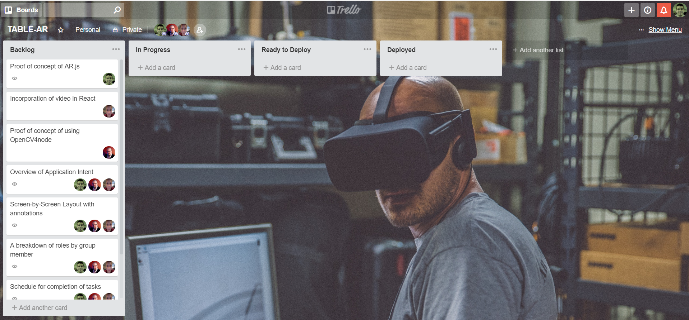

# TABLE-AR DOCUMENTATION
#### Created by Geoff Goodwin, Alex Gonzalez, & Thomas Yeager

## OVERVIEW
Table AR seeks to introduce a means of effective task management while leveraging Computer Vision (CV) and Augmented Reality (AR) techniques to physically interact with digital elements.  The user will be able to prioritize items, manage completion status, and create new tasks for management.  As the interaction will be within the context of a logged in user experience, we will have access to track duration of tasks from the point of creation to completion for long term trend analysis as well as categorization of tasks for efficiency comparisons.

## BREAKDOWN OF ROLES

## SCHEDULE OF COMPLETION OF TASKS

## TRELLO BOARD

## SCREEN-BY-SCREEN DESIGN LAYOUT
 [View this PDF](./Click-Through-Prototype_Table-AR.pdf)